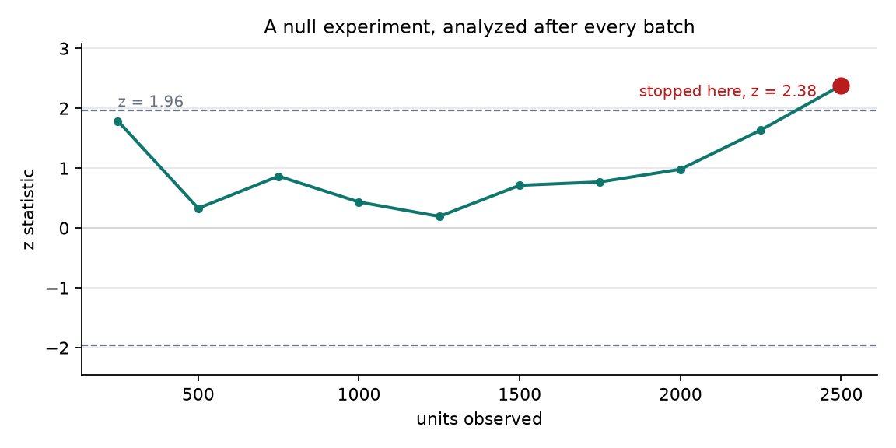
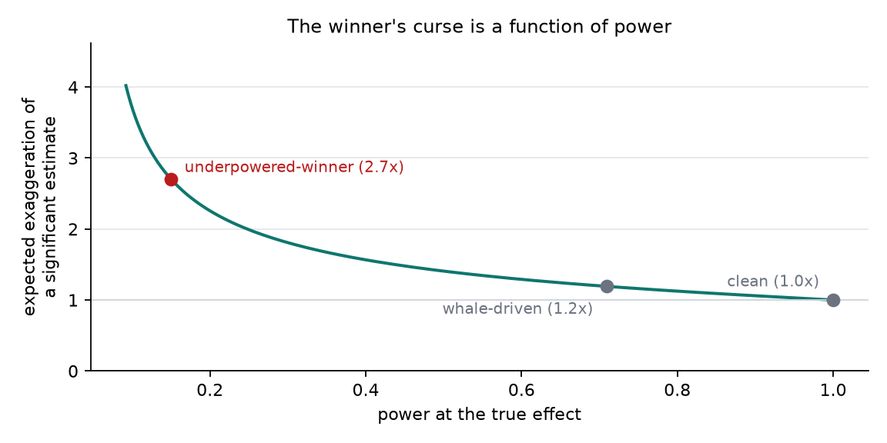

# abkit

Audit an A/B-test readout before you ship the decision.

[](https://github.com/mohammadi-hadi/abkit/actions/workflows/ci.yml)

An experiment readout can say "B wins, p = 0.03, ship it" while the traffic
split was broken, three whale customers carried the whole effect, the analyst
stopped at the first significant refresh, the winning metric was one of forty
tried, or the experiment never had the power to estimate what it now claims.
None of that shows up in the p-value. abkit reads the per-unit data and the
intended design, measures each of these failure modes, and flags whatever
leaves the range a healthy experiment could occupy.

## The audit in one table

Eight synthetic experiments, seven implanted defects. Bold values are flags;
each lands on the row where its defect was implanted, and the clean row
carries none.

<!-- abkit:demo -->
| experiment | implanted defect | SRM p | contam. | fragility | look FPR | novelty gap | uncorrected | exagg. | flags |
|---|---|---|---|---|---|---|---|---|---|
| clean | nothing | 0.89 | 0 | 20 | - | -0.02 | - | 1.0 | none |
| traffic-leak | 3% of traffic diverted to treatment | **4.1e-14** | 0 | 20 | - | -0.02 | - | 1.0 | sample ratio mismatch |
| double-dipper | 25 units assigned to both arms | 0.67 | **25** | 20 | - | -0.03 | - | 1.0 | assignment contamination |
| whale-driven | 3 extreme units carry the significance | 0.11 | 0 | **1** | - | 0.26 | - | 1.2 | outlier fragility |
| peeker | null effect, stopped at the first significant look | 0.55 | 0 | 8 | **0.19** | -0.17 | - | 1.2 | peeking |
| fading-novelty | early-half effect 0.30, late-half effect 0.00 | 0.041 | 0 | 20 | - | **0.31** | - | 1.0 | novelty |
| metric-fisher | null effect, 40 secondary metrics tested | 0.054 | 0 | 0 | - | -0.11 | **2** | 3.4 | uncorrected winners |
| underpowered-winner | true effect 0.1, powered for 0.14 of that chance | 0.91 | 0 | 8 | - | -0.38 | - | **2.7** | winner's curse |
<!-- /abkit:demo -->

The row to sit with is `peeker`: a true null effect, analyzed after every
batch of 250 units and stopped the moment z crossed 1.96. Its final readout
is indistinguishable from a real win — p < 0.05, decent sample size — but the
schedule it followed has a 19% false-positive rate, not 5%. The audit flags
the process, which is the only place that defect lives.





`make demo` regenerates the table, the [full report](results/report.md) and
the figures from fixed seeds; CI rebuilds them from pinned dependencies and
fails if a committed number differs from what the code produces.

## 4,873 real experiments, audited

[`examples/upworthy/`](examples/upworthy/) runs abkit's aggregate checks over
the exploratory split of the [Upworthy Research Archive](https://doi.org/10.1038/s41597-021-00934-7)
— 4,873 real headline A/B tests from 2013–2015. Committed results:
[examples/upworthy/results/upworthy.md](examples/upworthy/results/upworthy.md).

- **16% of real tests fail the sample-ratio check** at p < 0.001 against the
  platform's equal-allocation design — and not because packages were added
  mid-test; the rate is, if anything, higher in tests whose variants all
  launched together. Those readouts carried unknown exposure bias.
- **10.9% of tests have a "significant winner"** (best headline beats the
  runner-up at raw p < 0.05), but Benjamini–Hochberg across all 4,873
  winner comparisons keeps only **2.7%** of them.
- The median significant winning lift (0.85 CTR points, power 0.62) is
  expected to **overstate its true effect by 1.27x** even when the winner is
  real — the winner's curse, measured on real experiments.

## Install

```
pip install abkit
```

Python 3.11+. Runtime dependencies: numpy, pydantic, matplotlib.

## Quickstart

Log one JSON object per randomized unit, and the design the experiment was
supposed to follow:

```json
{"unit_id": "u1", "arm": "treatment", "metrics": {"revenue": 12.4, "conversion": 1.0}, "pre": {"revenue": 9.1}, "t": 1718040000}
```

```json
{
  "split": {"control": 0.5, "treatment": 0.5},
  "control": "control",
  "treatment": "treatment",
  "primary_metric": "revenue",
  "alpha": 0.05,
  "mde": 0.5,
  "looks": [{"n": 20000, "z": 1.31}, {"n": 40000, "z": 2.11}]
}
```

```python
from abkit import load_units, load_design, run_audit

audit = run_audit(load_units("units.jsonl"), load_design("design.json"))
for flag in audit.flags:
    print(flag.name, "--", flag.detail)
```

Or from the shell, with an exit code CI can gate on:

```
abkit report units.jsonl --design design.json --out audit --fail-on-flags
```

Alongside `report.md` the audit writes `report.json` for pipelines that gate
on specific numbers. Any check that could not run is listed with the exact
fields to log to enable it — a skip describes the log file, not the
experiment.

## What it checks

| check | question it answers | needs |
|---|---|---|
| sample ratio mismatch | did the split the readout assumes actually happen? | arms + intended split |
| assignment contamination | is any unit in more than one arm? | unit ids |
| covariate balance | were the groups equivalent before the treatment? | `pre` covariates |
| outlier fragility | how many extreme units does significance rest on? | per-unit primary metric |
| uncorrected winners | do the claimed wins survive multiple-testing control? | 2+ metrics |
| peeking | what false-positive rate did the stopping rule really have? | `design.looks` |
| novelty | is the single reported effect averaging over a changing one? | `t` per unit |
| winner's curse | how exaggerated is a significant estimate at this power? | `design.mde` (or observed) |
| variance ratio | does the treatment move the distribution, not just the mean? | per-unit primary metric |
| CUPED headroom | how much tighter could the CI have been? | `pre` covariates |

## How the numbers are defended

- **Cross-checked implementations.** The chi-square survival function matches
  scipy to 1e-10 across df 1–10, Welch's statistic matches
  `scipy.stats.ttest_ind`, the two-proportion z matches statsmodels
  `proportions_ztest`, and Benjamini–Hochberg reproduces statsmodels
  `multipletests` decisions exactly. The library itself depends on none of
  them.
- **Known closed-form results.** The Gelman–Carlin power / Type-S /
  exaggeration triple is checked against numerical integration to 1e-6, and
  the peeking simulator reproduces the classical repeated-significance rates
  (0.083 at 2 looks, 0.142 at 5, 0.193 at 10) within Monte-Carlo tolerance.
- **Validation by implantation.** The synthetic experiments have defect
  dials, and the tests require each probe to recover its dial — an implanted
  0.3 covariate shift must read as SMD 0.3 — to stay monotone in it, and to
  stay silent on the clean experiment.
- **Drift-checked results.** The demo table, report and README numbers are
  regenerated by CI from pinned dependencies and diffed against the
  committed copy.

## Design notes

- **Innocent bands, not point nulls.** With enough data an SMD of 0.02
  excludes zero while meaning nothing. Band probes declare the interval a
  healthy experiment could plausibly occupy — SMD and novelty gap within
  ±0.10 — and flag only when the whole 95% bootstrap CI leaves it. Exact
  procedures use the field's conventional thresholds: SRM at p < 0.001,
  contamination at zero tolerance. All constants live in one place
  ([`probes.py`](src/abkit/probes.py)) and are easy to disagree with.
- **The stopping rule is audited, not the final p.** A peeked experiment's
  final test statistic looks ordinary; what is broken is the procedure that
  produced it. The peeking probe Monte-Carlos the analyst's actual look
  schedule under the null and reports the false-positive rate that schedule
  had.
- **Fragility is counted in units, not sigmas.** "Removing two customers
  overturns the decision" is a statement a stakeholder can act on; a
  leave-one-out influence statistic is not.
- **Exaggeration needs a basis effect.** With `design.mde` the winner's-curse
  probe reports power and exaggeration at the effect the experiment was
  designed for; without it, the observed effect is used and labeled an
  optimistic bound, since conditioning on significance inflates it.
- **Stratified bootstrap.** Units are resampled within their arm, never
  across, so group sizes — which determine every statistic's sampling
  distribution — are preserved.
- **Deterministic to the digit.** Seeded PCG64 everywhere, no BLAS in any
  statistic's path, and a pinned drift environment: the same data gives the
  same report on any machine.

## Limitations

- An audit is bounded by what was logged. No pre-period covariates, no
  balance or CUPED checks; no look history, no peeking check; no per-unit
  data at all, and only the aggregate checks (`abkit.stats`) apply.
- The innocent bands are judgment calls, not derivations.
- The peeking probe assumes the recorded looks are all the looks there were.
- Fragility uses a greedy removal path; it upper-bounds, and in adversarial
  cases may not find, the true minimal flip set.
- Implantation shows the probes detect the mechanisms simulated; real
  experiments can fail in ways not simulated here.
- The Upworthy analysis treats the archive's documented equal allocation as
  the intended split; if some tests intentionally used unequal splits, their
  SRM flags are misattributed.

## Related work

The failure modes measured here are the standard ones from the online
experimentation literature: sample-ratio mismatch and its taxonomy
([Fabijan et al., 2019](https://doi.org/10.1145/3292500.3330722)), trustworthy
experimentation practice ([Kohavi, Tang & Xu, 2020](https://experimentguide.com/)),
peeking and always-valid inference ([Johari et al., 2017](https://doi.org/10.1145/3097983.3097992)),
variance reduction with pre-experiment data — CUPED
([Deng et al., 2013](https://doi.org/10.1145/2433396.2433413)),
Type-M/Type-S errors ([Gelman & Carlin, 2014](https://doi.org/10.1177/1745691614551642)),
the winner's curse in A/B testing ([Lee & Shen, 2018](https://doi.org/10.1145/3219819.3219905)),
and experimentation culture at scale
([Kaufman, Pitchforth & Vermeer, 2017](https://arxiv.org/abs/1710.08217)).
The real-data case study uses the Upworthy Research Archive
([Matias, Munger & Watts, 2021](https://doi.org/10.1038/s41597-021-00934-7)).
abkit's contribution is packaging the checks as one auditable tool with
uncertainty on every number and validation by implantation.

Companion projects: [judgekit](https://github.com/mohammadi-hadi/judgekit)
applies the same audit-before-you-trust pattern to LLM judges;
[trajectory-judge](https://github.com/mohammadi-hadi/trajectory-judge)
measures what outcome-only judges miss on agent trajectories.

## Citation

If abkit is useful in your work, please cite it (see
[CITATION.cff](CITATION.cff)):

```bibtex
@software{mohammadi_abkit,
  author  = {Mohammadi, Hadi},
  title   = {abkit: audit an A/B-test readout before you ship the decision},
  url     = {https://github.com/mohammadi-hadi/abkit},
  version = {0.1.0},
  year    = {2026}
}
```

## License

MIT
