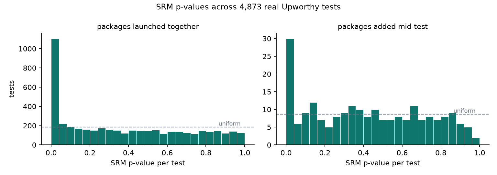

# abkit on the Upworthy Research Archive

4,873 real headline tests (22,666 packages) from the archive's exploratory
split, audited with abkit's aggregate-count checks. Regenerate with
`make upworthy` (downloads 14 MB from OSF on first run).

## Sample ratio mismatch

Upworthy assigned packages to equal traffic shares, so within a test the
impression counts should pass a chi-square test against an even split.

| stratum | tests | SRM flags (p < 0.001) | rate |
|---|---|---|---|
| all packages launched together | 4656 | 737 | 15.8% |
| packages added mid-test | 217 | 16 | 7.4% |

Nearly one in six real tests fails the standard validity gate — and the failures are
not explained by packages being added mid-test, because the rate is just as
high in the 4656 tests whose packages were all created within an hour of
each other. Whatever the mechanism (variants paused by editors, traffic
throttling, mid-test edits), the CTR comparisons in those 753
tests carry unknown exposure bias, and an SRM gate would have quarantined
them before anyone read the winner off the dashboard.

## The winner's curse, measured on real experiments

For every test, compare the best-CTR package against the runner-up:

- **10.9%** of tests (533 of 4873) have a
  "significant winner" at raw p < 0.05.
- Benjamini-Hochberg across all 4873 winner tests keeps
  **134** of them (2.7%).
- The median significant winning lift is
  **0.85 percentage points** of CTR with a standard error of
  0.38 points: power 0.62 against a same-size true effect,
  so the winning margin is expected to overstate the truth by
  **1.27x** (27% exaggeration) even when
  the winner is real.

Data: Matias, Munger & Watts (2021), The Upworthy Research Archive,
Scientific Data 8:195, https://doi.org/10.1038/s41597-021-00934-7 —
distributed via https://osf.io/jd64p/ and not redistributed here.
